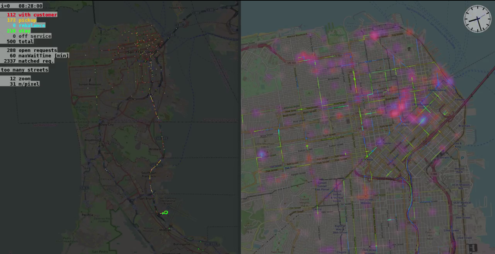

# Task: Autonomous Mobility-on-Demand on AMoDeus {#amod status=beta}

We introduce a challenge that is presently too extensive to conduct in Duckietown. Instead, the task is carried out only in simulation. In the future, this is expected change as Duckietowns across the world experience a tremendous growth in population, mostly due to the significant immigration of Duckies with an engineering background.

We use the simulation platform AMoDeus \cite{amodeus}. AMoDeus is a virtual mobility-on-demand simulator on which operational policies for large-scale AMoD systems can be developed and tested. You may coordinate thousands of robotic taxis in cities to pick up and deliver customers with your algorithm hosted by the AMoDeus engine in the background.

The design of operational policies for AMoD systems is a challenging task for various reasons:
* The vehicles operate on a **large and complex network** with varying travel-times and time-varying congestion effects.
* **Every decision** which is taken **influences other decisions**. For instance, if a taxi has picked up a customer, the vehicle is not available to service other close-by requests until the customer is dropped off.
* Running an AMoD system with good service levels is a task that requires to chose the number of employed robotic taxis correctly, to reduce the empty miles driven and maintain good wait and journey times for the customers. These are conflicting goals.

Operating AMoD systems is a challenging task that requires complex decision-making and anticipative action-taking. This makes it an ideal challenge for NIPS!

## Platform

AMoDeus is an open-source software package for the accurate and quantitative analysis of autonomous mobility-on-demand systems. It internally utilizes the agent-based transportation simulator [MATSim](https://www.matsim.org/). In its inner loop, it simulates the traffic in a city on a queuing network which takes into account congestion and network effects inherent to transportation systems. In its outer loop, it enables the agents to change their transportation behavior based on arbitrary utility functions that may include tolerance to delay, travel time, cost etc. In this challenge we will work with the inner loop and a static demand profile. A possible extension to dynamic demand is expected to follow in a next iteration of the challenge.

The performance of AMoD systems both in terms of customer satisfaction as well as efficiency highly depends on the operational policies that guide the behavior of the fleet. Notably, there are two types of decisions that have to be made:

1. **Dispatching:** the appearing requests of customers have to be responded to in an on-demand fashion. The decision which available robotic taxi picks up an open request has to be taken into account by the algorithm and is called a **dispatch command**.
2. **Rebalancing:** available, temporarily unused cars can be sent to another location in the network to meet future anticipated demand, a process called rebalancing. The **rebalancing commands** are determined by the operational policy of the system. Rebalancing is optional: depending on the situation and cost, it may be best to leave an idle robotic taxi at its current location.

To facilitate the comparison of operational policies, AMoDeus contains fleet efficiency and service level analysis methods. The most important metrics are automatically included in a report. Among them is the status of the robotic taxis during the course of one day as shown in Figure \ref{fig:status}.
Furthermore, benchmark operational policies are included in AMoDeus which serve as a benchmark for new policies. Finally, AMoDeus has an in-built graphical viewer that allows in-depth insights into the system. A screenshot of the viewer is shown in Figure \ref{fig:viewer}.

<figcaption>
A graphic from the AMoDeus report showing the status distribution of robotic taxis throughout the simulation day.
</figcaption>

<figcaption>Screenshots of simulation scenarios for San Francisco. AMoDeus allows users and algorithm designers to dynamically visualize their results to get a better understanding of the system.</figcaption>

## Description of Task

The goal of the AMoD challenges is to create an operational policy that maximizes the service level of the AMoD system while minimizing its operational cost:

**A well-performing autonomous mobility-on-demand system uses as few taxis as possible to pickup and deliver as many customers as possible with minimal waiting and journey times while keeping the fleet mileage to a minimum.**

We have prepared AMoD scenarios in four different cities on which you can work with a fleet of virtual robotic taxis to test and develop operational policies based on artificial intelligence or other methods. A simulation includes 1 day of time-varying travel demand in congested or uncongested networks and **several 10,000 of customer requests**. The following scenarios will be available for training:

* **San Francisco:**  this scenario represents a static demand extracted from San Francisco taxi data available online. There is a total of 23 datasets, one per day from 18th of May, 2008 to 9th of June, 2008. The linkspeeds are adapted to match the travel times shown in the dataset. The original dataset is available online [here](https://crawdad.org/epfl/mobility/20090224/).
* **Berlin:** the existing MATSim Open Berlin Scenario presented by D. Ziemke and K. Nagel [here](https://www.sciencedirect.com/science/article/pii/S1877050916301442) was altered such that all car trips now need to be served by autonomous mobility-on-demand in an efficient way. This is a very large scenario with more than 1 million of agents.
* **Santiago de Chile:** the scenario presented in the [publication](https://www.researchgate.net/profile/Benjamin_Kickhoefer/publication/306391968_Creating_an_open_MATSim_scenario_from_open_data_The_case_of_Santiago_de_Chile/links/57bc539908ae9fdf82f14fa3/Creating-an-open-MATSim-scenario-from-open-data-The-case-of-Santiago-de-Chile.pdf) by B. Kickhöfer, D. Hosse, K. Turner and A. Tirachini was altered such that all public transportation and `colectivo` trips now have to served efficiently with a fleet of robotic taxis. 
* **Tel Aviv:** The travel demand in this scenario is created based on the Israel National Travel Habits Survey from 1996. It was [published](http://transp-or.epfl.ch/heart/2017/abstracts/hEART2017_paper_110.pdf) by G. Ben-Dor, B. Dmitrieva, M. Maciejewski, J. Bischoff, E. Ben-Elia, and I Benenson  The entire transportation demand (both public and private transportation) needs to be served with a fleet of autonomous vehicles.

The operational policy has to guide the behavior of the fleet and take the following decisions online while the simulation is running:

## Interface and Protocol

A complete documentation of the interface is provided [here](https://github.com/idsc-frazzoli/amod/blob/dh025/doc/aido-client-protocol.md). We briefly summarize the overall structure here on this page as a quick introduction. Two different main functions are need to be used to participate in the challenge, both are dockerized. One of them is the **AidoGuest**, one of them is the **AidoHost**. The **AidoGuest** contains the code written by the participant of the challenge, the **AidoHost** runs the simulation and performs all necessary computation.

* **Pre-Execution Steps:** in this part of the challenge execution, the designer can specify if a specific scenario should be used or a random scenario. The **AidoHost** responds by communicating a bounding box of the network in WGS84 coordinates, the total number of customer requests as well as the standard fleet size $$\bar{N}$$ for championships 1 and 2. Then, the number of requests to be used in the simulation smaller or equal to the maximal number and the desired fleet size can be specified by **AidoGuest**. The **AidoHost** will then start the main loop of the simulation. 
* **Simulation Execution:** during the simulation, the **AidoGuest** receives the current status of the system and then sends commands as specified in the previous section. After a completed simulation (1 day) the results are passed to the post-execution environment.
* **Post-Execution Steps:** here, the designer has access to various tools that help to understand and quantify the performance of the algorithm for the AMoD system. Dedicated AMoD performance reports can be accessed that include information about the waiting times throughout the day, distances driven etc. One of the graphs from the report is shown in Figure \ref{fig:reportFigure}. Finally a graphical viewer to visualize simulation results on a map of the city is available to provide more insight into the algorithm’s performance. It is displayed in Figure \ref{fig:viewerScreenshots}. The final scores for all performance metrics will be communicated at the end of the run.

### Evaluation

The AMoD task is evaluated on the performance objectives described in [*performance objective*](#performance_amod)
